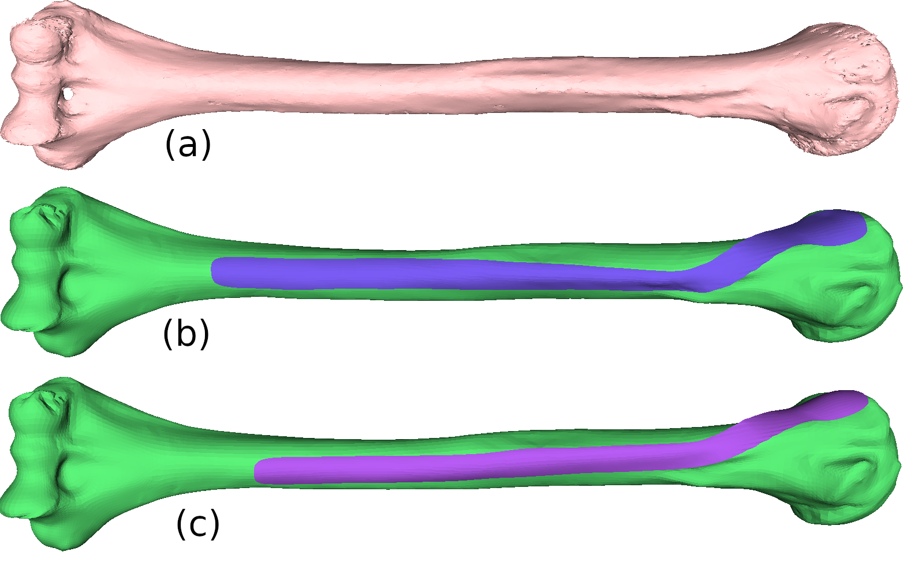
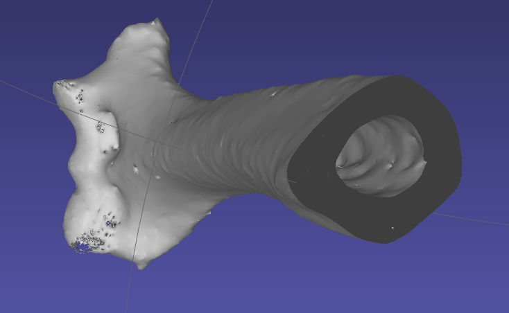
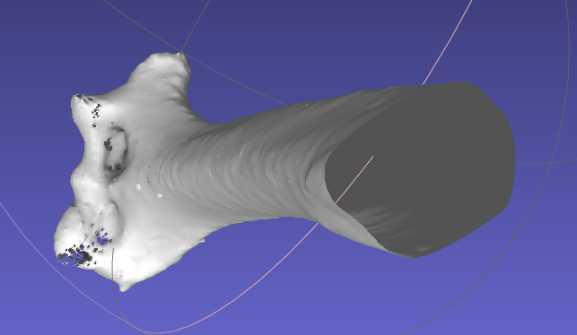

# HumerusPlate

Given a humerus 3D scan, extract a custom 3D implant (plate) shape or position an existing plate on it.

This is the official repository of the MICCAI 2023 paper : "Optimizing the 3D Plate Shape for Proximal Humerus Fractures" by Keller et al. 

See the [project page](https://humerusplate.is.tue.mpg.de/) and [paper](https://humerusplate.is.tue.mpg.de/media/upload/paper2383.pdf) for more information.


<p align="center">
  
</p>

<p style="text-align: center;"><i> 
Given a humerus scan (a), we register a template bone and generate a custom plate for the bone (b), <br>or we optimize the placement of an existing plate on the bone (c).</i></p>


# Installation

```
git clone https://github.com/MarilynKeller/HumerusPlate.git
cd HumerusPlate
python3.8 -m venv ~/.virtualenvs/humplate_venv
source ~/.virtualenvs/humplate_venv/bin/activate
pip install -r requirements.txt
pip install git+https://github.com/mattloper/chumpy # do not use pip install chumpy, we need version 0.71 which has no released binaries
pip install git+https://github.com/MPI-IS/mesh.git 
pip install -e .
```

To run the bone registration and the plate positioning optimization, you will need to compile sample2meshdist library as follows:

```
cd sbody/mesh_distance
python setup.py install
```

Finally, download the data folder from the project page Download section : https://humerusplate.is.tue.mpg.de and unzip it to get the following hierarchie: 

```
HumerusPlate/
├─ data/
│  ├─ plate_set
│  ├─ samples
│  ├─ templates
├─ humplate/
├─ demos/
...
```


# Usage

## Humerus PCA

To visualize the humerus shape space, run:
```
python demos/plot_pca.py --anat
```

To visualize how the bone's fixation area vary in orientation, run:
```
demos/plot_pca.py --heatmap
```

The visualization is stored as a video in the `output` folder.

## Humerus scan registration

This code registers (align) our humerus statistical shape model to a targer humerus scan.

```
python demos/register_bone.py --scan_path data/samples/0677_scan.ply -D
```

## Plate extraction 

Given a registered humerus, we can extract a custom implant shape.
```
python demos/plate_extract.py --bone_path data/samples/0677_reg.ply
```

## Plate positioning 

Given a plate and a bone with the same topology as our template, we optimize for the best rotation and translation of the plate so that is is positioned properly on the bone.

The following script positions the plate s0 on the registered bone 0677_reg.ply. The resulting optimal positioning (rotation and translation) are stored in the `output` folder.
```
python demos/fit_plate.py -p "s0" -b data/samples/0677_reg.ply
```

The particle seach initialized the pla in different positions for robustness to local minima. You can control the number of particles and number of parallel process from `humplate/config.py`.
With the `-D` argument, you can visualize the plate position optimization process vizually. 

## Other

This script display the humerus and plate templates with the fixation zones defined on it.
```
python demos/plate_template.py
```

The ordered plate set created as described in the paper is stored in `data/plate_set`.

# Troubleshooting

For bones scanned using a CT scanner, the bone reconstructed from the scan can have a layer of triangles inside the bone:
For a successfull scan registration, the inside vertices and faces must be removed. You can clean your scan in the (Meshlab)[https://www.meshlab.net/] software, by following the steps below:

1. Filters > Color Creation and Processing > Ambient Occlusion -> Apply 

2. Filters > Selection > Select by Vertex Quality. Play with sliders to select low quality values, i.e. all the interior vertices that are not visible (try min 0, max 0.1). -<> Apply

3. Filters > Selection > Delete Selected Vertices

Here is an example of CT bone scan before and after cleaning.





# Acknowledgment

This work was supported by the project CAMed (COMET K- Project 871132) which is funded by the Austrian Federal Ministry of Transport, Innovation and Technology (BMVIT) and the Austrian Federal Ministry for Digital and Economic Affairs (BMDW) and the Styrian Business Promotion Agency (SFG). Michael J. Black (MJB) has received research gift funds from Adobe, Intel, Nvidia, Meta/Facebook, and Amazon. MJB has financial interests in Amazon, Datagen Technologies, and Meshcapade GmbH. MJB’s research was performed solely at MPI. The authors thank the International Max Planck Research School for Intelligent Systems for supporting Marilyn Keller.
For the scanned humerus dataset, we acknowledge Dr. Brian Corner, Dr. Jeff Hudson who did the scanning, and the Cleveland Museum of Natural History Physical Anthropology Dept for access to the Hamann-Todd human skeletal collection. We also thank Anja Gieringer for the bone CT scans and Karoline Seibert at Hofer GmbH & Co KG, Fürstenfeld, Austria for the 3D printing of bones and plates.


# License

This code and model are available for non-commercial scientific research purposes as defined in the [LICENSE.txt](LICENSE.txt) file.


# Contact

For more questions, please contact humerusplate@tue.mpg.de.

For commercial licensing, please contact ps-licensing@tue.mpg.de